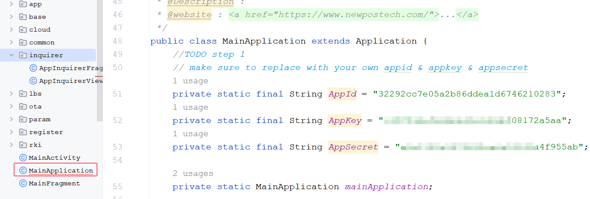

# Apply for a newposstore account #
Use your email to register an account on the NEWSTORE developer platform and apply for enterprise developer certification. The website of the NEWSTORE platform is：[https://newposstore.com/account/login?redirect=/account](https://newposstore.com/account/login?redirect=/account "NEWPOSSTORE")
# Create capability application #
The operation steps for creating an ability application can be referred to in the current directory files "createAbilityApp.wmv".
<video src="./files/createAbilityApp.wmv" controls width="600">
  Your browser does not support video playback. Please switch to another browser.Your browser does not support video playback. Please switch to another browser and try again.
</video>

# Configure relevant parameters #
## config appKey infomation ##
The parameters such as AppKey obtained through creating the capability application need to be configured in the MainApplication.java file of the app module of the current project. Of course, this is a demo project. The specific configuration location should be according to the requirements of the third-party APP project.

## modify appliciationId ##
Modify the applicationId in the project's build.gradle file to the package name configured when creating the capability application.
# Do Test #
Currently, the APP testing relies on the NEWPOS intelligent terminal, and the terminal needs to install the NEWPOSSTORE app. For the intelligent terminal equipment and related installation package APP, you can contact newposstore@newpostech.com for acquisition.

# Notes for Attention #
- The signature fingerprint information filled in when creating the capability application is the SHA256 fingerprint information of the signature certificate, represented as a 16-digit hexadecimal string, with colons separating the digits.
- The signature information during the program's operation needs to be consistent with that when creating the capability application. Therefore, you need to replace the signature certificate information in DEMO with your own.